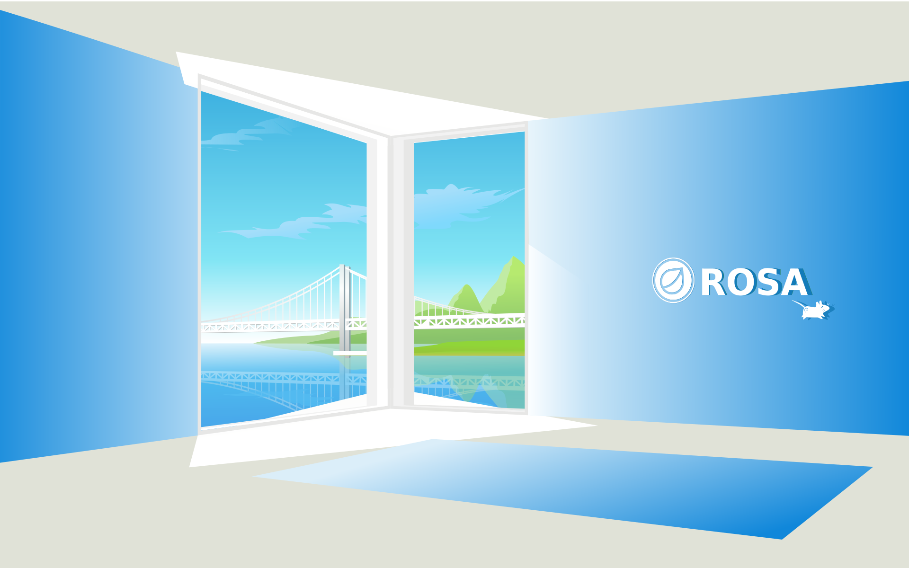
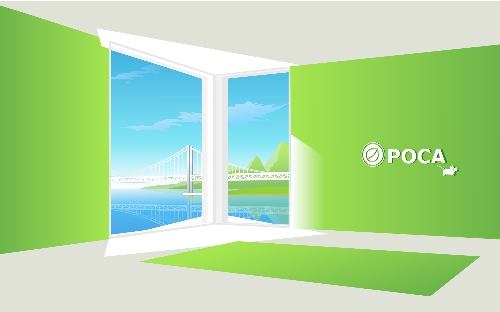
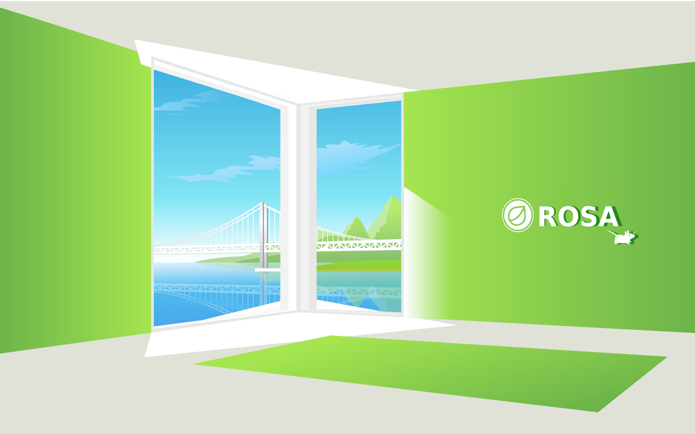

xfce-background-office
======================

Обои XFCE Роса офис 

## Изображение (может немного отличатся от оригинала)

## Доступные разрешения

* 800x480
* 1366x768
* 1280x1024
* 1920x1080
* 1920x1200
* 1920x1440

## Установка

1. `git clone https://github.com/chistota/rospo-wallpaper-neru-city.git /usr/share/wallpapers/
2. `chmod -R 755 /usr/share/wallpapers/`

## Сообщество ВК
РОСПО Дизайн-студия
https://vk.com/rospodesign
